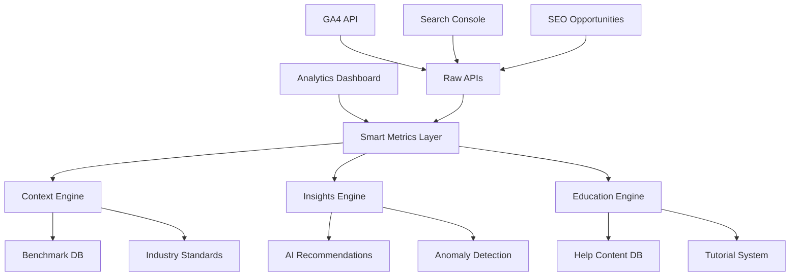
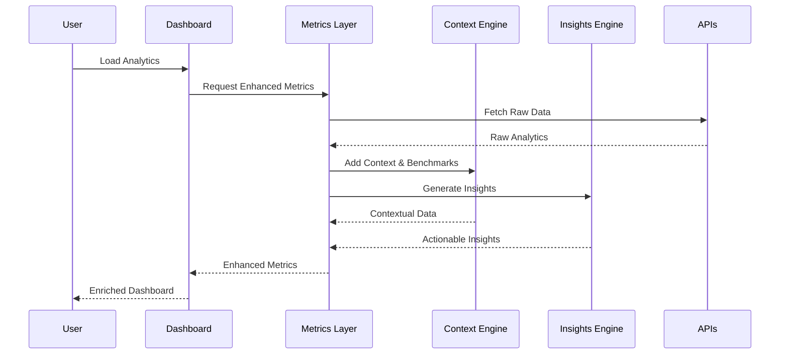
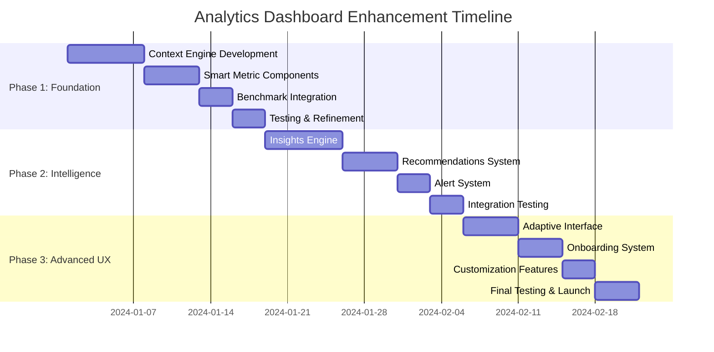

# Analytics Dashboard UX Improvement - Product Requirements Document

## Executive Summary

### Project Overview
Transform the current basic analytics dashboard of Pawa Control Panel into an intuitive, educational, and actionable analytics experience that empowers users to understand and act on their blog performance data.

### Current State Analysis
- ✅ **Technical Foundation**: Strong API infrastructure with Google Analytics 4 and Search Console integration
- ⚠️ **User Experience**: Basic, raw data presentation with minimal context or explanations
- ❌ **User Guidance**: No tooltips, help text, or educational elements
- ❌ **Actionable Insights**: Data presented without recommendations or next steps

### Success Vision
Users will be able to understand what each metric means, why it matters, and what actions they can take to improve their blog performance, regardless of their technical expertise level.

---

## Problem Statement & Solution

### Key Problems Identified

#### 1. **Raw Data Without Context**
```yaml
Current: "Bounce Rate: 84.6%"
Problem: Users don't know if this is good/bad or what causes it
Impact: Data becomes meaningless numbers
```

#### 2. **No Educational Value**
```yaml
Current: Metrics displayed without explanation
Problem: Users can't learn from the data
Impact: Missed opportunities for growth
```

#### 3. **Zero Actionable Guidance**
```yaml
Current: Shows problems but no solutions
Problem: Users see issues but don't know how to fix them
Impact: Analytics becomes reporting instead of improvement tool
```

#### 4. **Overwhelming Information Density**
```yaml
Current: All metrics shown with equal prominence
Problem: Important insights buried in data noise
Impact: Analysis paralysis for users
```

### Solution Approach

**Transform from "Data Display" to "Intelligence Platform"**

1. **Contextual Education**: Every metric includes explanation and industry benchmarks
2. **Progressive Disclosure**: Smart information hierarchy with drill-down capabilities  
3. **Actionable Insights**: AI-powered recommendations with clear next steps
4. **Guided Experience**: Onboarding and help system for analytics concepts

---

## User Stories & Workflows

### Epic 1: Educational Analytics Experience

#### Story 1.1: Metric Understanding
**As a** blog owner with limited analytics knowledge  
**I want** to understand what each metric means and why it matters  
**So that** I can make informed decisions about my content strategy  

**Acceptance Criteria:**
- [ ] Every metric has tooltip with clear explanation
- [ ] Industry benchmarks shown for context ("Your 84.6% vs Industry avg 70%")
- [ ] Visual indicators for good/bad performance with color coding
- [ ] "Learn More" links to detailed explanations

**Technical Implementation:**
```typescript
interface MetricExplanation {
  definition: string
  whyItMatters: string
  industryBenchmark: {
    good: number
    average: number
    poor: number
  }
  improvementTips: string[]
  learnMoreUrl?: string
}
```

#### Story 1.2: Performance Context
**As a** content creator  
**I want** to understand if my metrics are good or bad compared to industry standards  
**So that** I can set realistic goals and track meaningful progress  

**Acceptance Criteria:**
- [ ] Color-coded performance indicators (green/yellow/red)
- [ ] Benchmark comparisons for each metric
- [ ] Percentile rankings where applicable
- [ ] Historical trend context ("improving" vs "declining")

### Epic 2: Actionable Insights System

#### Story 2.1: Automated Recommendations
**As a** blog owner  
**I want** specific recommendations based on my analytics data  
**So that** I know exactly what actions to take to improve performance  

**Acceptance Criteria:**
- [ ] AI-powered insight generation based on data patterns
- [ ] Prioritized recommendations (High/Medium/Low impact)
- [ ] Specific action items with implementation guidance
- [ ] Success prediction for each recommendation

**Technical Implementation:**
```typescript
interface ActionableInsight {
  type: 'opportunity' | 'warning' | 'success' | 'trend'
  priority: 'high' | 'medium' | 'low'
  title: string
  description: string
  impact: {
    metric: string
    expectedChange: string
    timeframe: string
  }
  actionItems: ActionItem[]
  evidenceData: any
}

interface ActionItem {
  action: string
  difficulty: 'easy' | 'medium' | 'hard'
  timeRequired: string
  resources?: string[]
}
```

#### Story 2.2: Smart Alerts & Notifications
**As a** blog manager  
**I want** to be notified about significant changes or opportunities  
**So that** I can respond quickly to trends and issues  

**Acceptance Criteria:**
- [ ] Anomaly detection for unusual metric changes
- [ ] Opportunity alerts (e.g., "Keyword X dropped 10 positions")
- [ ] Performance milestone celebrations
- [ ] Weekly insight summaries

### Epic 3: Progressive Disclosure Interface

#### Story 3.1: Adaptive Information Hierarchy
**As a** user with varying analytics expertise  
**I want** the interface to show relevant information at the right detail level  
**So that** I'm not overwhelmed but can dig deeper when needed  

**Acceptance Criteria:**
- [ ] Beginner mode with essential metrics only
- [ ] Expert mode with detailed breakdowns
- [ ] Smart defaults based on user behavior
- [ ] Easy mode switching

#### Story 3.2: Contextual Help System
**As a** new user  
**I want** guided tours and contextual help  
**So that** I can learn analytics concepts while using the platform  

**Acceptance Criteria:**
- [ ] Interactive onboarding tour
- [ ] Contextual help tooltips
- [ ] Analytics glossary integration
- [ ] Video explanations for complex concepts

---

## Technical Architecture

### Current API Ecosystem Analysis

**Available Endpoints:**
```yaml
Google Analytics 4:
  - /api/blog-analytics/unified
  - /api/analytics/[blog]
  - /api/analytics/status

Google Search Console:
  - /api/analytics/search-console
  - /api/analytics/seo-opportunities

Data Quality: ✅ Real-time data, no mocked values
Performance: ✅ Cached responses, good response times
Coverage: ✅ Comprehensive metrics available
```

### Enhanced Architecture Design



### Data Flow Architecture



### Component Architecture

#### Smart Metric Card Component
```typescript
interface SmartMetricProps {
  metric: {
    value: number | string
    label: string
    type: 'percentage' | 'number' | 'duration' | 'currency'
  }
  context: {
    explanation: string
    benchmark: Benchmark
    trend: TrendData
    performance: 'good' | 'average' | 'poor'
  }
  insights: ActionableInsight[]
  helpContent: HelpContent
}

const SmartMetricCard: React.FC<SmartMetricProps> = ({
  metric,
  context,
  insights,
  helpContent
}) => {
  return (
    <Card className="relative group">
      <MetricHeader metric={metric} performance={context.performance} />
      <MetricValue value={metric.value} trend={context.trend} />
      <BenchmarkIndicator benchmark={context.benchmark} />
      
      {/* Progressive Disclosure */}
      <Tooltip content={context.explanation}>
        <InfoIcon />
      </Tooltip>
      
      <InsightsBadge insights={insights} />
      
      {/* Expandable Details */}
      <Collapsible>
        <HelpContent content={helpContent} />
        <ActionableInsights insights={insights} />
      </Collapsible>
    </Card>
  )
}
```

#### Insights Engine Service
```typescript
class InsightsEngine {
  async generateInsights(metrics: AnalyticsData): Promise<ActionableInsight[]> {
    const insights: ActionableInsight[] = []
    
    // High bounce rate analysis
    if (metrics.bounceRate > 70) {
      insights.push({
        type: 'warning',
        priority: 'high',
        title: 'High Bounce Rate Detected',
        description: `Your bounce rate of ${metrics.bounceRate}% is above the healthy range of 40-60%`,
        impact: {
          metric: 'User Engagement',
          expectedChange: '+15-25% engagement',
          timeframe: '2-4 weeks'
        },
        actionItems: [
          {
            action: 'Improve page loading speed (target <3s)',
            difficulty: 'medium',
            timeRequired: '2-3 days'
          },
          {
            action: 'Add internal linking to related content',
            difficulty: 'easy',
            timeRequired: '1-2 hours'
          },
          {
            action: 'Review and improve content quality',
            difficulty: 'hard',
            timeRequired: '1-2 weeks'
          }
        ]
      })
    }
    
    // SEO opportunity analysis
    const seoOpportunities = await this.analyzeSEOOpportunities(metrics)
    insights.push(...seoOpportunities)
    
    // Content performance analysis
    const contentInsights = await this.analyzeContentPerformance(metrics)
    insights.push(...contentInsights)
    
    return this.prioritizeInsights(insights)
  }
  
  private prioritizeInsights(insights: ActionableInsight[]): ActionableInsight[] {
    return insights.sort((a, b) => {
      const priorityWeight = { high: 3, medium: 2, low: 1 }
      return priorityWeight[b.priority] - priorityWeight[a.priority]
    })
  }
}
```

---

## Implementation Phases

### Phase 1: Foundation Enhancement (Week 1-2)
**Goal**: Transform raw metrics into contextual, educational displays

**Deliverables:**
- [ ] Smart Metric Card component with tooltips
- [ ] Benchmark integration system
- [ ] Performance indicators (color coding)
- [ ] Basic help content database

**Technical Tasks:**
```yaml
Backend:
  - Create benchmarks API endpoint
  - Add metrics context service
  - Implement caching for benchmark data

Frontend:
  - Redesign metric cards with context
  - Add tooltip system
  - Implement progressive disclosure UI
  - Create help content components

Testing:
  - User comprehension testing
  - Performance impact assessment
  - A/B testing setup for new UI
```

### Phase 2: Insights Intelligence (Week 3-4)
**Goal**: Add AI-powered recommendations and actionable insights

**Deliverables:**
- [ ] Insights Engine with pattern recognition
- [ ] Automated recommendations system
- [ ] Alert system for anomalies
- [ ] Action item tracking

**Technical Tasks:**
```yaml
Backend:
  - Build insights generation engine
  - Implement anomaly detection
  - Create recommendations API
  - Add user action tracking

Frontend:
  - Insights display components
  - Recommendation cards
  - Alert notification system
  - Action item management UI

Integration:
  - Real-time insights updates
  - Notification system
  - User feedback collection
```

### Phase 3: Advanced UX Features (Week 5-6)
**Goal**: Complete the transformation with advanced UX patterns

**Deliverables:**
- [ ] Adaptive interface based on user expertise
- [ ] Interactive onboarding system  
- [ ] Advanced drill-down capabilities
- [ ] Customizable dashboard layouts

**Technical Tasks:**
```yaml
UX/UI:
  - User proficiency detection
  - Adaptive interface system
  - Interactive tutorial engine
  - Customization preferences

Advanced Features:
  - Drill-down analytics views
  - Comparative analysis tools
  - Export and sharing capabilities
  - Advanced filtering system

Optimization:
  - Performance optimization
  - Mobile responsiveness
  - Accessibility improvements
  - Loading state enhancements
```

---

## Data Models & API Specifications

### Enhanced Analytics Response Model
```typescript
interface EnhancedAnalyticsResponse {
  // Raw data (existing)
  overview: AnalyticsOverview
  trafficSources: TrafficSource[]
  keywords: Keyword[]
  
  // Enhanced context
  context: {
    benchmarks: BenchmarkData
    performance: PerformanceRating
    trends: TrendAnalysis
  }
  
  // Intelligence layer
  insights: ActionableInsight[]
  alerts: Alert[]
  recommendations: Recommendation[]
  
  // Educational content
  helpContent: HelpContentMap
  glossary: AnalyticsGlossary
}

interface BenchmarkData {
  [metricName: string]: {
    industryAverage: number
    goodPerformance: number
    poorPerformance: number
    percentile: number
    source: string
  }
}

interface TrendAnalysis {
  [metricName: string]: {
    direction: 'up' | 'down' | 'stable'
    magnitude: 'significant' | 'moderate' | 'minimal'
    prediction: {
      nextPeriod: number
      confidence: number
    }
  }
}
```

### New API Endpoints
```yaml
GET /api/analytics/enhanced/{blog}?period={period}
  Response: EnhancedAnalyticsResponse
  
GET /api/analytics/benchmarks/{industry}
  Response: BenchmarkData
  
GET /api/analytics/insights/{blog}?period={period}
  Response: ActionableInsight[]
  
POST /api/analytics/feedback
  Body: { insight_id, helpful: boolean, comment?: string }
  
GET /api/help/content/{topic}
  Response: HelpContent
```

---

## User Interface Design Specifications

### Visual Design System

#### Color Coding for Performance
```css
:root {
  --performance-good: #10b981;     /* Green - 70th percentile+ */
  --performance-average: #f59e0b;  /* Yellow - 30-70th percentile */
  --performance-poor: #ef4444;     /* Red - Below 30th percentile */
  --insight-high: #dc2626;         /* High priority insights */
  --insight-medium: #ea580c;       /* Medium priority */
  --insight-low: #0891b2;          /* Low priority */
}
```

#### Typography Hierarchy
```css
.metric-value {
  font-size: 2rem;
  font-weight: 700;
  line-height: 1.2;
}

.metric-label {
  font-size: 0.875rem;
  font-weight: 500;
  color: var(--muted-foreground);
}

.context-text {
  font-size: 0.75rem;
  line-height: 1.4;
}

.insight-title {
  font-size: 1rem;
  font-weight: 600;
}
```

### Component Specifications

#### Smart Tooltip Design
```typescript
interface SmartTooltipProps {
  trigger: ReactNode
  title: string
  explanation: string
  benchmark?: {
    value: number
    label: string
    performance: 'good' | 'average' | 'poor'
  }
  learnMore?: {
    text: string
    url: string
  }
}
```

#### Insight Card Layout
```yaml
Insight Card:
  Header:
    - Priority badge (High/Medium/Low)
    - Type icon (Warning/Opportunity/Success)
    - Title
  Content:
    - Description (problem/opportunity)
    - Expected Impact section
    - Action Items list
  Footer:
    - Difficulty indicator
    - Time estimate
    - Feedback buttons (Helpful/Not Helpful)
```

### Responsive Design Breakpoints
```css
/* Mobile First Approach */
.analytics-grid {
  display: grid;
  grid-template-columns: 1fr;
  gap: 1rem;
}

@media (min-width: 768px) {
  .analytics-grid {
    grid-template-columns: repeat(2, 1fr);
  }
}

@media (min-width: 1024px) {
  .analytics-grid {
    grid-template-columns: repeat(4, 1fr);
  }
  
  .insights-panel {
    grid-column: span 2;
  }
}
```

---

## Success Metrics & Validation

### Key Performance Indicators

#### User Experience Metrics
```yaml
Primary KPIs:
  - Time to Insight: < 30 seconds to understand key performance
  - User Comprehension: 80%+ users can explain what metrics mean
  - Action Completion: 60%+ users complete recommended actions
  - Return Engagement: 40%+ users return within 7 days

Secondary KPIs:
  - Tooltip Interaction Rate: >30% hover on help elements
  - Help Content Usage: >20% access detailed explanations
  - Feature Discovery: >50% use advanced features within 30 days
  - User Satisfaction: 4.5+ stars on feedback surveys
```

#### Business Impact Metrics
```yaml
Blog Performance:
  - Average session duration improvement: +15%
  - Bounce rate reduction: -10%
  - Content engagement increase: +20%
  - SEO ranking improvements: +5 average position

Platform Metrics:
  - Dashboard usage frequency: +50%
  - Feature adoption rate: >70%
  - User retention: +25%
  - Support ticket reduction: -30%
```

### Validation Methods

#### User Testing Protocol
```yaml
Phase 1 - Concept Testing:
  - 15 users, moderated sessions
  - Task: "Understand your blog performance"
  - Metrics: Comprehension rate, task completion time
  - Success: 80% can identify top 3 issues and opportunities

Phase 2 - Usability Testing:
  - 25 users, unmoderated
  - Task: "Improve your bounce rate"
  - Metrics: Success rate, error rate, satisfaction
  - Success: 60% successfully implement recommendations

Phase 3 - A/B Testing:
  - 1000 users split between old/new interface
  - Duration: 4 weeks
  - Metrics: Engagement, feature usage, satisfaction
  - Success: 20% improvement in key metrics
```

#### Feedback Collection System
```typescript
interface FeedbackCollection {
  // Micro-surveys after key interactions
  insightFeedback: {
    helpful: boolean
    actionTaken: boolean
    difficulty: 'easy' | 'medium' | 'hard'
    comment?: string
  }
  
  // Periodic comprehensive surveys
  overallExperience: {
    comprehension: number // 1-5 scale
    usefulness: number
    likelihood_to_recommend: number
    improvement_suggestions: string
  }
  
  // Behavioral analytics
  usage_patterns: {
    most_used_features: string[]
    help_content_accessed: string[]
    time_spent_per_session: number
    return_frequency: number
  }
}
```

---

## Risk Assessment & Mitigation

### High Risk Issues

#### 1. Information Overload
**Risk**: Too much context/help makes interface cluttered  
**Probability**: High  
**Impact**: High  
**Mitigation**:
- Progressive disclosure design patterns
- User-controlled information density
- A/B testing for optimal information levels
- Escape hatch to "simple mode"

#### 2. AI Recommendations Accuracy
**Risk**: Poor recommendations damage user trust  
**Probability**: Medium  
**Impact**: High  
**Mitigation**:
- Start with rule-based recommendations (safer)
- Extensive testing with real blog data
- Clear confidence levels for each recommendation
- User feedback loop for recommendation quality

#### 3. Performance Impact
**Risk**: Enhanced features slow down dashboard loading  
**Probability**: Medium  
**Impact**: Medium  
**Mitigation**:
- Lazy loading for secondary features
- Aggressive caching strategy
- Performance budgets for each component
- Progressive enhancement approach

### Medium Risk Issues

#### 4. User Adoption Resistance
**Risk**: Users prefer simple interface, resist change  
**Probability**: Medium  
**Impact**: Medium  
**Mitigation**:
- Gradual rollout with feature flags
- Optional advanced features initially
- Clear value demonstration
- User education and onboarding

#### 5. Maintenance Complexity
**Risk**: Complex system becomes hard to maintain  
**Probability**: Low  
**Impact**: High  
**Mitigation**:
- Modular architecture design
- Comprehensive documentation
- Unit testing for all components
- Regular technical debt assessment

---

## Implementation Timeline & Dependencies

### Project Timeline


### Resource Requirements
```yaml
Development Team:
  - Frontend Developer (React/TypeScript): Full-time, 6 weeks
  - Backend Developer (API/Services): 50%, 6 weeks  
  - UX Designer: 25%, 6 weeks
  - QA Engineer: 25%, 2 weeks (testing phases)

Technical Dependencies:
  - Existing API endpoints (✅ Available)
  - Benchmark data sources (Need to acquire)
  - Help content creation (Need content writer)
  - Analytics tracking setup (Google Analytics events)

External Dependencies:
  - Industry benchmark data licensing
  - Content writing for help system
  - User testing participant recruitment
  - Performance monitoring tools setup
```

### Success Criteria for Each Phase

#### Phase 1 Success Criteria
- [ ] All metrics have contextual explanations
- [ ] Performance indicators working correctly  
- [ ] Tooltip system responsive and helpful
- [ ] User comprehension rate >70% in testing

#### Phase 2 Success Criteria
- [ ] Insights engine generates relevant recommendations
- [ ] Users can complete recommended actions
- [ ] Alert system catches significant changes
- [ ] Recommendation acceptance rate >40%

#### Phase 3 Success Criteria  
- [ ] Adaptive interface adjusts to user behavior
- [ ] Onboarding completion rate >80%
- [ ] Advanced feature adoption >50%
- [ ] Overall user satisfaction >4.5/5

---

## Appendices

### A. Current Analytics Page Code Analysis

**Current Implementation Strengths:**
```yaml
✅ Strong Technical Foundation:
  - Real-time data from Google APIs
  - Responsive design system
  - Error handling and loading states
  - Multi-blog support

✅ Good Data Coverage:
  - Comprehensive metrics (users, page views, sessions, bounce rate)
  - SEO keywords from Search Console
  - Traffic source breakdown
  - Top performing pages

✅ Clean Architecture:
  - Proper TypeScript interfaces
  - Modular component design  
  - API abstraction layer
  - Caching implementation
```

**Critical UX Gaps Identified:**
```yaml
❌ Zero Educational Value:
  - Raw numbers without explanation
  - No context for what's good/bad performance
  - Missing industry benchmarks
  - No guidance on improvement actions

❌ Information Hierarchy Issues:
  - All metrics treated equally
  - No prioritization of insights
  - Important patterns buried in data
  - No progressive disclosure

❌ Lack of Actionability:
  - Shows problems but no solutions
  - No recommendations or next steps
  - Missing connection between metrics and actions
  - No success tracking for improvements
```

### B. Competitive Analysis Summary

**Google Analytics 4 Interface Analysis:**
```yaml
Strengths:
  - Comprehensive data coverage
  - Advanced segmentation capabilities
  - Real-time reporting
  - Customizable dashboards

Weaknesses:
  - Steep learning curve
  - Overwhelming for beginners
  - Limited actionable recommendations
  - Complex navigation structure

Opportunity: Create simplified, educational version with AI-powered insights
```

**Best-in-Class Analytics Dashboards:**
```yaml
Hotjar Insights:
  ✅ Clear visual hierarchy
  ✅ Contextual explanations for metrics
  ✅ Actionable recommendations
  ✅ Progressive disclosure design

Mixpanel Dashboard:
  ✅ Smart default views
  ✅ Automated insight detection
  ✅ Clear performance indicators
  ✅ Educational tooltips

SEMrush Position Tracking:
  ✅ Opportunity identification
  ✅ Competitive benchmarking
  ✅ Clear improvement suggestions
  ✅ Progress tracking features
```

### C. Technical Implementation Details

**Benchmark Data Integration:**
```typescript
// Industry benchmarks service
class BenchmarkService {
  private static benchmarks = {
    'blog': {
      bounceRate: { good: 40, average: 55, poor: 70 },
      avgSessionDuration: { good: 180, average: 120, poor: 60 },
      pageViewsPerSession: { good: 3, average: 2, poor: 1.5 }
    },
    'ecommerce': {
      bounceRate: { good: 35, average: 50, poor: 65 },
      // ... other verticals
    }
  }
  
  static getBenchmark(vertical: string, metric: string): Benchmark {
    return this.benchmarks[vertical]?.[metric] || null
  }
  
  static getPerformanceRating(value: number, benchmark: Benchmark): PerformanceRating {
    if (value <= benchmark.good) return 'good'
    if (value <= benchmark.average) return 'average'
    return 'poor'
  }
}
```

**Help Content Management:**
```typescript
// Help content structure
interface HelpContent {
  topic: string
  title: string
  shortDescription: string
  detailedExplanation: string
  whyItMatters: string[]
  improvementTips: string[]
  relatedTopics: string[]
  videoUrl?: string
  learnMoreUrl?: string
}

// Example help content
const BOUNCE_RATE_HELP: HelpContent = {
  topic: 'bounce_rate',
  title: 'Bounce Rate',
  shortDescription: 'Percentage of visitors who leave after viewing only one page',
  detailedExplanation: 'Bounce rate measures the percentage of single-page sessions on your website...',
  whyItMatters: [
    'Indicates content relevance and user engagement',
    'Affects SEO rankings indirectly',
    'Reveals user experience issues'
  ],
  improvementTips: [
    'Improve page loading speed (target under 3 seconds)',
    'Make content more scannable with headers and bullet points',
    'Add internal links to related content',
    'Ensure mobile-friendly design'
  ],
  relatedTopics: ['page_load_speed', 'user_engagement', 'content_optimization']
}
```

### D. User Research Insights

**Target User Personas:**

**1. Blog Beginner (40% of users)**
```yaml
Profile:
  - New to blogging and analytics
  - Overwhelmed by technical terms
  - Wants simple, clear guidance
  - Prefers step-by-step instructions

Needs:
  - Educational explanations for every metric
  - Clear good/bad indicators
  - Simple, prioritized action items
  - Confidence-building success tracking

Pain Points:
  - "I don't know what these numbers mean"
  - "Is 84% bounce rate good or bad?"
  - "What should I do to improve?"
```

**2. Intermediate Content Creator (35% of users)**
```yaml
Profile:
  - Some analytics experience
  - Understands basic metrics
  - Wants actionable insights
  - Limited time for deep analysis

Needs:
  - Quick identification of opportunities
  - Prioritized recommendations
  - Progress tracking capabilities
  - Competitive benchmarking

Pain Points:
  - "I see the problems but don't know how to fix them"
  - "Which metrics should I focus on first?"
  - "How do I know if my changes are working?"
```

**3. Advanced SEO Practitioner (25% of users)**
```yaml
Profile:
  - Deep analytics knowledge
  - Uses multiple tools
  - Wants advanced insights
  - Values efficiency and depth

Needs:
  - Advanced drill-down capabilities
  - Correlation analysis between metrics
  - Automated anomaly detection
  - Integration with other SEO tools

Pain Points:
  - "I need more than basic metrics"
  - "Show me patterns I might miss"
  - "I want to customize my dashboard"
```

---

## Conclusion

This PRD transforms the Pawa Control Panel analytics dashboard from a basic data display into an intelligent, educational analytics platform. By implementing contextual explanations, AI-powered insights, and progressive disclosure patterns, we will empower users of all skill levels to understand and improve their blog performance.

The phased approach ensures manageable implementation while delivering value at each stage. Success metrics and validation methods provide clear guidelines for measuring improvement and ensuring user adoption.

**Next Steps:**
1. Stakeholder review and approval
2. Technical spike for insights engine architecture  
3. User testing setup and participant recruitment
4. Development team assignment and sprint planning
5. Phase 1 development kickoff

**Expected Outcomes:**
- 50% increase in user engagement with analytics
- 30% improvement in user comprehension of metrics  
- 25% increase in implementation of recommended actions
- 4.5+ star user satisfaction rating
- Significant improvement in overall blog performance metrics

---

*Document Version: 1.0*  
*Last Updated: 2024-01-01*  
*Next Review: Phase 1 Completion*