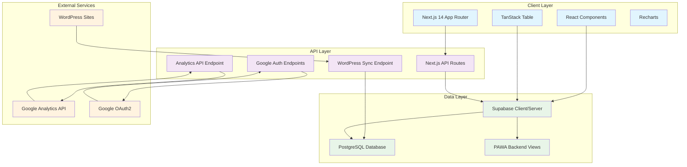
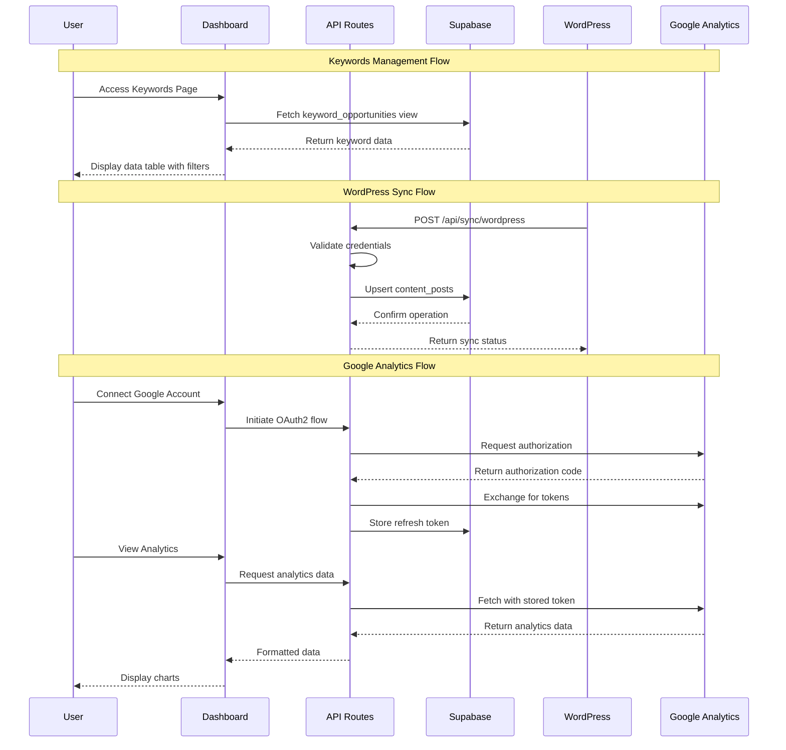

# PAWA Control Panel - Comprehensive Planning PRD

## Executive Summary

The PAWA Control Panel is a sophisticated SEO and content management dashboard built to interface with the existing Backend PAWA system. This Next.js 14 application will provide a comprehensive business intelligence interface for managing keywords, synchronizing WordPress content, and visualizing Google Analytics data.

### Key Value Proposition
- **Unified SEO Management**: Single dashboard for all keyword and content operations
- **Real-time Synchronization**: Automated WordPress content pipeline integration
- **Advanced Data Visualization**: Interactive charts and tables for analytics insights
- **Enterprise-grade Architecture**: Scalable, type-safe, and maintainable codebase

## Problem & Solution

### Current State Problems
1. **Data Fragmentation**: SEO data scattered across multiple systems without unified view
2. **Manual Content Sync**: WordPress content updates require manual intervention
3. **Limited Analytics Visibility**: Google Analytics data not integrated with SEO workflow
4. **Inefficient Keyword Management**: No advanced filtering or opportunity scoring interface

### Solution Architecture
A modern, responsive dashboard that consolidates all PAWA system functionality into a single, powerful interface with real-time data synchronization and advanced visualization capabilities.

## User Stories & Requirements

### Epic 1: Keywords Management Dashboard

#### Story 1.1: Advanced Keywords Data Table
**As a** SEO Specialist  
**I want** to view, filter, and analyze keyword opportunities in a comprehensive data table  
**So that** I can efficiently identify and prioritize content opportunities

**Acceptance Criteria:**
- [ ] Display keywords with msv, difficulty, cpc, competition, search_intent, is_used, opportunity_score
- [ ] Global search filtering across all columns
- [ ] Individual column filters with dropdown/input options
- [ ] Sortable columns with visual indicators
- [ ] Paginated results with configurable page sizes
- [ ] Export functionality to CSV/Excel formats
- [ ] Responsive design for mobile and tablet views

**Technical Notes:**
- Use TanStack Table v8 for advanced table functionality
- Server-side data fetching with Next.js Server Components
- Client-side filtering and sorting for performance
- Supabase RLS policies for data security

#### Story 1.2: Keyword Opportunity Scoring
**As a** Content Manager  
**I want** to see calculated opportunity scores for each keyword  
**So that** I can prioritize content creation efforts

**Acceptance Criteria:**
- [ ] Visual indicators for high/medium/low opportunity scores
- [ ] Detailed scoring methodology tooltip
- [ ] Color-coded rows based on opportunity level
- [ ] Filtering by opportunity score ranges
- [ ] Integration with existing PAWA scoring algorithms

### Epic 2: WordPress Content Synchronization

#### Story 2.1: Automated Content Sync
**As a** Blog Administrator  
**I want** to automatically sync WordPress posts to the PAWA system  
**So that** content data remains up-to-date without manual intervention

**Acceptance Criteria:**
- [ ] Webhook endpoint for WordPress post updates
- [ ] Basic Authentication validation using Application Passwords
- [ ] Automatic upsert operations to content_posts table
- [ ] Error handling and logging for failed sync attempts
- [ ] Status monitoring dashboard for sync operations
- [ ] Support for multiple blog instances

**Technical Notes:**
- Secure API route with proper authentication
- Database upsert using slug and blog_id as conflict resolution
- Error reporting and retry mechanisms
- Audit logging for all sync operations

#### Story 2.2: Sync Status Monitoring
**As a** System Administrator  
**I want** to monitor the status of WordPress synchronization  
**So that** I can ensure data integrity and troubleshoot issues

**Acceptance Criteria:**
- [ ] Real-time sync status dashboard
- [ ] Historical sync logs with timestamps
- [ ] Error alerts and notifications
- [ ] Manual retry functionality for failed syncs
- [ ] Performance metrics (sync speed, success rates)

### Epic 3: Google Analytics Integration

#### Story 3.1: OAuth2 Authentication
**As a** Marketing Analyst  
**I want** to securely connect my Google Analytics account  
**So that** I can access analytics data within the PAWA dashboard

**Acceptance Criteria:**
- [ ] Google OAuth2 consent flow implementation
- [ ] Secure token storage in Supabase
- [ ] Automatic token refresh mechanism
- [ ] Error handling for authentication failures
- [ ] Multi-user support with individual connections

**Technical Notes:**
- PKCE implementation for enhanced security
- Encrypted token storage
- Scopes: analytics.readonly, adwords (if needed)
- Proper error handling and user feedback

#### Story 3.2: Analytics Data Visualization
**As a** Marketing Analyst  
**I want** to view Google Analytics data in interactive charts  
**So that** I can analyze website performance alongside SEO data

**Acceptance Criteria:**
- [ ] Sessions by page path visualization
- [ ] Customizable date ranges
- [ ] Multiple chart types (line, bar, area)
- [ ] Data export functionality
- [ ] Real-time data updates
- [ ] Mobile-responsive chart display

## Technical Architecture

### System Architecture Diagram



### Data Flow Architecture



### Database Schema Integration

Based on the existing PAWA backend documentation, the system will integrate with:

#### Core Tables
- `blogs` - Multi-blog management
- `main_keywords` - Strategic keyword repository  
- `keyword_variations` - Semantic keyword variants
- `content_posts` - WordPress content synchronization

#### Key Views
- `keyword_opportunities` - Calculated opportunity scores
- Analytics views for dashboard aggregation

#### Custom Functions
- `find_similar_keywords()` - Semantic similarity search
- `analyze_content_gaps()` - Content opportunity analysis
- `hybrid_search_posts()` - Multi-modal content search

## API Specifications

### Keywords API

#### GET /api/keywords
```typescript
interface KeywordOpportunity {
  keyword: string;
  msv: number;
  kw_difficulty: number;
  cpc: number;
  competition: string;
  search_intent: string;
  is_used: boolean;
  opportunity_score: number;
  blog_id: string;
}

interface KeywordsResponse {
  data: KeywordOpportunity[];
  pagination: {
    page: number;
    pageSize: number;
    total: number;
  };
}
```

### WordPress Sync API

#### POST /api/sync/wordpress
```typescript
interface WordPressPayload {
  id: number;
  slug: string;
  title: string;
  content: string;
  excerpt: string;
  status: 'publish' | 'draft' | 'private';
  published_date: string;
  modified_date: string;
  author: string;
  categories: string[];
  tags: string[];
}

interface SyncResponse {
  success: boolean;
  message: string;
  post_id?: string;
  error?: string;
}
```

### Google Analytics API

#### GET /api/analytics?startDate=&endDate=&metrics=
```typescript
interface AnalyticsData {
  pagePath: string;
  sessions: number;
  pageviews: number;
  bounceRate: number;
  avgSessionDuration: number;
}

interface AnalyticsResponse {
  data: AnalyticsData[];
  dateRange: {
    startDate: string;
    endDate: string;
  };
  totals: {
    sessions: number;
    pageviews: number;
  };
}
```

## Component Architecture

### Folder Structure
```
src/
├── app/
│   ├── (dashboard)/
│   │   ├── layout.tsx           # Dashboard layout with navigation
│   │   ├── page.tsx             # Dashboard home
│   │   ├── keywords/
│   │   │   └── page.tsx         # Keywords management page
│   │   ├── pipeline/
│   │   │   └── page.tsx         # Content pipeline Kanban
│   │   └── analytics/
│   │       └── page.tsx         # Analytics dashboard
│   ├── api/
│   │   ├── sync/wordpress/      # WordPress synchronization
│   │   ├── auth/google/         # Google OAuth2 flow
│   │   └── analytics/           # Analytics data fetching
│   ├── layout.tsx               # Root layout
│   └── page.tsx                 # Landing/login page
├── components/
│   ├── ui/                      # Shadcn/ui components
│   ├── dashboard/
│   │   ├── KeywordsDataTable.tsx
│   │   ├── ProductionPipelineKanban.tsx
│   │   └── AnalyticsChart.tsx
│   └── shared/
│       └── SideNav.tsx
├── lib/
│   ├── supabase/
│   │   ├── client.ts            # Browser Supabase client
│   │   └── server.ts            # Server Supabase client
│   ├── google/
│   │   └── client.ts            # Google APIs integration
│   └── utils.ts                 # Utility functions
└── types/
    └── index.ts                 # TypeScript definitions
```

### Component Specifications

#### KeywordsDataTable Component
```typescript
interface KeywordsDataTableProps {
  initialData: KeywordOpportunity[];
  totalCount: number;
}

// Features:
// - Server-side pagination
// - Client-side filtering and sorting
// - Column visibility controls
// - Export functionality
// - Responsive design
```

#### AnalyticsChart Component
```typescript
interface AnalyticsChartProps {
  data: AnalyticsData[];
  chartType: 'line' | 'bar' | 'area';
  dateRange: DateRange;
  isLoading: boolean;
}

// Features:
// - Multiple chart types via Recharts
// - Interactive tooltips
// - Date range selection
// - Data export
// - Responsive scaling
```

## Implementation Phases

### Phase 1: Foundation Setup (Week 1-2)
**Priority: Critical**
- [ ] Next.js 14 project initialization with TypeScript
- [ ] Supabase client configuration (browser/server)
- [ ] Shadcn/ui component library setup
- [ ] Basic dashboard layout and navigation
- [ ] Database connection verification

**Dependencies:** Supabase project access, environment variables
**Deliverable:** Working dashboard shell with navigation

### Phase 2: Keywords Management (Week 2-3)
**Priority: High**
- [ ] TypeScript interfaces for database schemas
- [ ] Server Component for initial data fetching
- [ ] KeywordsDataTable with TanStack Table implementation
- [ ] Column sorting, filtering, and pagination
- [ ] Responsive design implementation

**Dependencies:** Phase 1 completion, database schema understanding
**Deliverable:** Fully functional keywords data table

### Phase 3: WordPress Integration (Week 3-4)
**Priority: High**
- [ ] WordPress sync API route with authentication
- [ ] Database upsert logic for content_posts
- [ ] Error handling and logging system
- [ ] Sync status monitoring dashboard
- [ ] Testing with WordPress webhook integration

**Dependencies:** Phase 1 completion, WordPress application passwords
**Deliverable:** Automated content synchronization system

### Phase 4: Google Analytics Integration (Week 4-5)
**Priority: Medium**
- [ ] Google OAuth2 flow implementation
- [ ] Secure token storage and refresh mechanism
- [ ] Analytics API integration with Google Analytics Data API
- [ ] AnalyticsChart component with Recharts
- [ ] Real-time data fetching and caching

**Dependencies:** Google Cloud project setup, OAuth2 credentials
**Deliverable:** Complete analytics dashboard with visualizations

### Phase 5: Advanced Features (Week 5-6)
**Priority: Low**
- [ ] Production pipeline Kanban board
- [ ] Advanced filtering and search capabilities
- [ ] Export functionality (CSV, Excel)
- [ ] Performance optimizations
- [ ] Mobile responsiveness enhancements

**Dependencies:** All previous phases
**Deliverable:** Production-ready dashboard with all features

## Risk Analysis & Mitigations

### High Risk: Database Performance
**Risk:** Large datasets may cause slow query performance in keywords table
**Impact:** Poor user experience, timeout errors
**Mitigation:** 
- Implement server-side pagination with limits
- Use database indexes on filtered columns
- Add query optimization for complex filters
- Consider implementing search debouncing

### Medium Risk: Google API Rate Limits
**Risk:** Google Analytics API rate limiting affects real-time data updates
**Impact:** Delayed or missing analytics data
**Mitigation:**
- Implement intelligent caching with appropriate TTL
- Use batch requests where possible
- Add retry logic with exponential backoff
- Display cached data with refresh timestamps

### Medium Risk: WordPress Integration Reliability
**Risk:** WordPress webhook failures or authentication issues
**Impact:** Content sync failures, data inconsistency
**Mitigation:**
- Implement robust error handling and logging
- Add manual retry mechanisms
- Create sync status monitoring
- Use queue system for failed requests

### Low Risk: UI Component Library Compatibility
**Risk:** Shadcn/ui components may not meet all design requirements
**Impact:** Development delays, UI inconsistencies
**Mitigation:**
- Prototype key components early
- Plan for custom component development
- Keep design system flexible
- Regular component library updates

## Success Metrics

### Performance Metrics
- [ ] **Page Load Time:** < 2 seconds for dashboard pages
- [ ] **Keywords Table Rendering:** < 1 second for 1000+ rows
- [ ] **API Response Time:** < 500ms for most endpoints
- [ ] **Mobile Responsiveness:** Works on devices 360px+ width

### Functionality Metrics  
- [ ] **Data Accuracy:** 100% sync accuracy between WordPress and database
- [ ] **Real-time Updates:** Analytics data updates within 5 minutes
- [ ] **Uptime:** 99.9% availability for sync endpoints
- [ ] **Error Rate:** < 1% error rate for all API operations

### User Experience Metrics
- [ ] **Filter Response Time:** < 100ms for client-side filtering
- [ ] **Search Functionality:** Global search returns results in < 200ms
- [ ] **Export Performance:** CSV export for 10,000 rows in < 10 seconds
- [ ] **Accessibility:** WCAG 2.1 AA compliance for all components

## Security Considerations

### Authentication & Authorization
- Google OAuth2 with PKCE for enhanced security
- Supabase Row Level Security (RLS) policies
- API route protection with proper authentication
- Secure token storage with encryption

### Data Protection
- Environment variable protection for sensitive keys
- HTTPS enforcement for all external communications
- Input validation and sanitization
- SQL injection prevention through parameterized queries

### WordPress Integration Security
- Basic Authentication validation for webhook endpoints
- Request origin verification
- Rate limiting on sync endpoints
- Audit logging for all sync operations

## Testing Strategy

### Unit Testing
- Component testing with React Testing Library
- API route testing with Next.js test utilities
- Database function testing with Jest
- Utility function testing with comprehensive coverage

### Integration Testing
- End-to-end dashboard workflows with Playwright
- WordPress sync integration testing
- Google Analytics API integration testing
- Database integration testing with test databases

### Performance Testing
- Load testing for keywords table with large datasets
- API endpoint performance testing
- Memory usage monitoring
- Bundle size optimization verification

## Monitoring & Logging

### Application Monitoring
- Real-time error tracking with detailed stack traces
- Performance monitoring for page load times
- API endpoint response time monitoring
- Database query performance tracking

### Business Intelligence
- Sync operation success/failure rates
- User engagement with dashboard features
- Keywords table usage patterns
- Analytics data refresh frequency

### Alerting System
- WordPress sync failure alerts
- Google API rate limit warnings
- Database performance degradation alerts
- Authentication failure notifications

## Deployment & DevOps

### Development Environment
- Local development with Docker compose
- Environment variable management
- Hot reload for rapid development
- Database seeding scripts

### Production Deployment
- Vercel deployment for optimal Next.js performance
- Environment variable security through Vercel dashboard
- Automatic deployments from main branch
- Database migrations through Supabase CLI

### Continuous Integration
- TypeScript compilation validation
- Linting and formatting checks
- Unit and integration test execution
- Bundle size optimization verification

## Appendices

### A. Database Schema Reference
Detailed schemas for all PAWA backend tables and views used by the application.

### B. API Documentation
Complete OpenAPI/Swagger specifications for all API endpoints.

### C. Component Library Standards
Shadcn/ui component usage guidelines and customization patterns.

### D. Performance Benchmarks
Target performance metrics and measurement methodologies.

### E. Security Checklist
Comprehensive security validation checklist for production deployment.

---

**Document Version:** 1.0  
**Last Updated:** August 27, 2025  
**Next Review:** Before Phase 1 Implementation  

This PRD serves as the comprehensive guide for implementing the PAWA Control Panel dashboard, ensuring all stakeholders understand requirements, technical architecture, and success criteria before development begins.